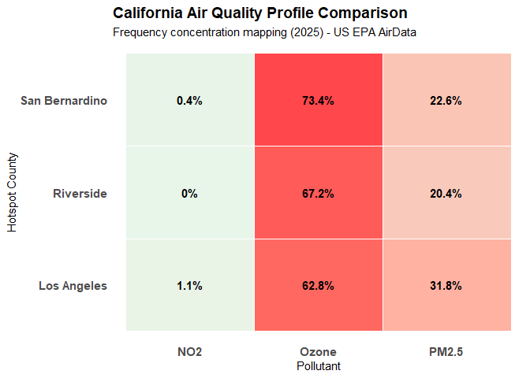
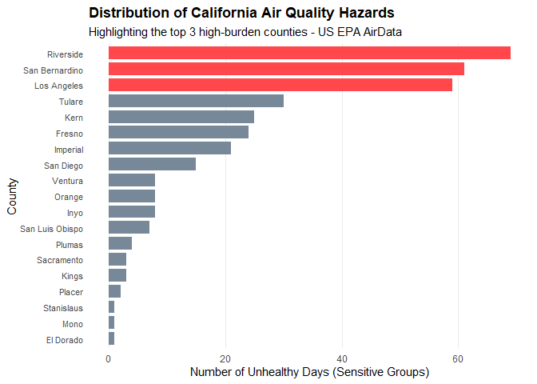

California Air Quality
================

## Introduction

I aimed to explore environmental data while becoming familiar with
R/RStudio tools. I retrieved 2025 summary data from the [US
Environmental Protection
Agency](https://aqs.epa.gov/aqsweb/airdata/download_files.html#Annual)
and completed exploratory analysis regarding air quality monitoring. I
became interested in air quality data as I grew up in the Inland Empire
region of Southern California, and have always been sensitive to outside
conditions including experiencing allergies, difficulty breathing, and
skin issues. It was a great opportunity to examine a topic that affects
public health as well as quality of life.

## Filtering data

The first thing to do was to filter out data for California counties.

| State | County | Year | Days.with.AQI | Good.Days | Moderate.Days | Unhealthy.for.Sensitive.Groups.Days | Unhealthy.Days | Very.Unhealthy.Days | Hazardous.Days | Max.AQI | X90th.Percentile.AQI | Median.AQI | Days.CO | Days.NO2 | Days.Ozone | Days.PM2.5 | Days.PM10 |
|:---|:---|---:|---:|---:|---:|---:|---:|---:|---:|---:|---:|---:|---:|---:|---:|---:|---:|
| California | Amador | 2025 | 211 | 179 | 32 | 0 | 0 | 0 | 0 | 97 | 58 | 40 | 0 | 0 | 211 | 0 | 0 |
| California | Butte | 2025 | 245 | 162 | 83 | 0 | 0 | 0 | 0 | 96 | 59 | 47 | 0 | 0 | 139 | 106 | 0 |
| California | Calaveras | 2025 | 207 | 153 | 54 | 0 | 0 | 0 | 0 | 100 | 62 | 43 | 0 | 0 | 162 | 44 | 1 |
| California | Colusa | 2025 | 265 | 225 | 40 | 0 | 0 | 0 | 0 | 96 | 54 | 39 | 0 | 0 | 149 | 109 | 7 |
| California | Del Norte | 2025 | 179 | 145 | 34 | 0 | 0 | 0 | 0 | 70 | 54 | 33 | 0 | 0 | 0 | 179 | 0 |
| California | El Dorado | 2025 | 212 | 182 | 29 | 1 | 0 | 0 | 0 | 115 | 58 | 39 | 0 | 0 | 211 | 0 | 1 |
| California | Fresno | 2025 | 304 | 122 | 157 | 24 | 1 | 0 | 0 | 157 | 100 | 54 | 0 | 0 | 214 | 84 | 6 |
| California | Glenn | 2025 | 212 | 170 | 42 | 0 | 0 | 0 | 0 | 94 | 54 | 40 | 0 | 0 | 154 | 51 | 7 |
| California | Humboldt | 2025 | 303 | 252 | 51 | 0 | 0 | 0 | 0 | 75 | 54 | 36 | 0 | 0 | 87 | 206 | 10 |
| California | Imperial | 2025 | 219 | 60 | 132 | 21 | 6 | 0 | 0 | 190 | 108 | 64 | 0 | 0 | 121 | 46 | 52 |
| California | Inyo | 2025 | 273 | 111 | 151 | 8 | 3 | 0 | 0 | 163 | 84 | 54 | 0 | 0 | 150 | 111 | 12 |
| California | Kern | 2025 | 273 | 65 | 183 | 25 | 0 | 0 | 0 | 143 | 100 | 61 | 0 | 0 | 150 | 117 | 6 |
| California | Kings | 2025 | 181 | 72 | 106 | 3 | 0 | 0 | 0 | 105 | 85 | 53 | 0 | 0 | 90 | 88 | 3 |
| California | Lake | 2025 | 34 | 34 | 0 | 0 | 0 | 0 | 0 | 32 | 29 | 17 | 0 | 0 | 0 | 30 | 4 |
| California | Los Angeles | 2025 | 274 | 30 | 155 | 59 | 29 | 1 | 0 | 201 | 151 | 77 | 1 | 3 | 172 | 87 | 11 |
| California | Madera | 2025 | 120 | 83 | 37 | 0 | 0 | 0 | 0 | 91 | 66 | 43 | 0 | 0 | 64 | 56 | 0 |
| California | Marin | 2025 | 20 | 20 | 0 | 0 | 0 | 0 | 0 | 32 | 29 | 21 | 0 | 0 | 0 | 20 | 0 |
| California | Mariposa | 2025 | 250 | 204 | 46 | 0 | 0 | 0 | 0 | 90 | 61 | 45 | 0 | 0 | 249 | 1 | 0 |
| California | Merced | 2025 | 90 | 58 | 32 | 0 | 0 | 0 | 0 | 78 | 68 | 43 | 0 | 0 | 43 | 47 | 0 |
| California | Mono | 2025 | 181 | 168 | 12 | 1 | 0 | 0 | 0 | 104 | 44 | 22 | 0 | 0 | 0 | 94 | 87 |
| California | Monterey | 2025 | 182 | 140 | 42 | 0 | 0 | 0 | 0 | 62 | 55 | 40 | 1 | 0 | 90 | 84 | 7 |
| California | Nevada | 2025 | 181 | 144 | 37 | 0 | 0 | 0 | 0 | 84 | 61 | 44 | 0 | 0 | 161 | 20 | 0 |
| California | Orange | 2025 | 274 | 122 | 143 | 8 | 1 | 0 | 0 | 159 | 77 | 52 | 1 | 8 | 114 | 149 | 2 |
| California | Placer | 2025 | 243 | 118 | 123 | 2 | 0 | 0 | 0 | 143 | 74 | 51 | 0 | 0 | 170 | 73 | 0 |
| California | Plumas | 2025 | 195 | 103 | 88 | 4 | 0 | 0 | 0 | 111 | 82 | 46 | 0 | 0 | 0 | 195 | 0 |
| California | Riverside | 2025 | 274 | 29 | 143 | 69 | 32 | 0 | 1 | 365 | 154 | 87 | 1 | 0 | 184 | 56 | 33 |
| California | Sacramento | 2025 | 224 | 132 | 89 | 3 | 0 | 0 | 0 | 122 | 71 | 48 | 1 | 0 | 129 | 94 | 0 |
| California | San Benito | 2025 | 223 | 202 | 21 | 0 | 0 | 0 | 0 | 71 | 50 | 41 | 0 | 0 | 197 | 26 | 0 |
| California | San Bernardino | 2025 | 274 | 34 | 137 | 61 | 38 | 4 | 0 | 207 | 164 | 90 | 1 | 1 | 201 | 62 | 9 |
| California | San Diego | 2025 | 272 | 116 | 136 | 15 | 5 | 0 | 0 | 161 | 93 | 54 | 0 | 0 | 178 | 94 | 0 |
| California | San Joaquin | 2025 | 182 | 120 | 62 | 0 | 0 | 0 | 0 | 93 | 67 | 44 | 0 | 0 | 77 | 105 | 0 |
| California | San Luis Obispo | 2025 | 273 | 120 | 146 | 7 | 0 | 0 | 0 | 119 | 69 | 51 | 0 | 0 | 143 | 130 | 0 |
| California | Santa Barbara | 2025 | 181 | 54 | 126 | 0 | 1 | 0 | 0 | 186 | 63 | 54 | 0 | 0 | 21 | 156 | 4 |
| California | Santa Cruz | 2025 | 181 | 148 | 33 | 0 | 0 | 0 | 0 | 71 | 57 | 37 | 0 | 0 | 98 | 83 | 0 |
| California | Shasta | 2025 | 232 | 197 | 35 | 0 | 0 | 0 | 0 | 100 | 54 | 44 | 0 | 0 | 203 | 21 | 8 |
| California | Siskiyou | 2025 | 15 | 15 | 0 | 0 | 0 | 0 | 0 | 10 | 9 | 6 | 0 | 0 | 0 | 15 | 0 |
| California | Solano | 2025 | 268 | 265 | 3 | 0 | 0 | 0 | 0 | 61 | 42 | 34 | 0 | 0 | 268 | 0 | 0 |
| California | Sonoma | 2025 | 273 | 273 | 0 | 0 | 0 | 0 | 0 | 39 | 18 | 9 | 0 | 0 | 0 | 0 | 273 |
| California | Stanislaus | 2025 | 249 | 170 | 78 | 1 | 0 | 0 | 0 | 101 | 71 | 45 | 1 | 0 | 182 | 64 | 2 |
| California | Sutter | 2025 | 212 | 130 | 82 | 0 | 0 | 0 | 0 | 100 | 67 | 48 | 0 | 0 | 126 | 86 | 0 |
| California | Tehama | 2025 | 212 | 171 | 41 | 0 | 0 | 0 | 0 | 90 | 54 | 36 | 0 | 0 | 97 | 109 | 6 |
| California | Trinity | 2025 | 152 | 104 | 48 | 0 | 0 | 0 | 0 | 83 | 66 | 33 | 0 | 0 | 0 | 152 | 0 |
| California | Tulare | 2025 | 232 | 69 | 133 | 30 | 0 | 0 | 0 | 140 | 105 | 59 | 0 | 0 | 138 | 93 | 1 |
| California | Tuolumne | 2025 | 210 | 175 | 35 | 0 | 0 | 0 | 0 | 87 | 58 | 40 | 0 | 0 | 210 | 0 | 0 |
| California | Ventura | 2025 | 273 | 144 | 121 | 8 | 0 | 0 | 0 | 131 | 71 | 50 | 0 | 0 | 160 | 107 | 6 |
| California | Yolo | 2025 | 273 | 165 | 108 | 0 | 0 | 0 | 0 | 100 | 62 | 47 | 0 | 0 | 132 | 141 | 0 |

However, out of 58 total counties, there are 12 missing in the dataset,
notably Bay Area counties. Missing urban counties: Alameda, Contra
Costa, Napa, San Francisco, San Mateo, and Santa Clara. Missing rural
counties: Alpine, Lassen, Mendocino, Modoc, Sierra, Yuba. As these
counties are not included in the original dataset, findings are not
fully representative of statewide conditions.

## Highest-burden counties

| County | Median.AQI | Good.Days | Days.with.AQI | percent_days_not_good | composite_score |
|:---|:--:|:--:|:--:|:--:|:--:|
| Riverside | 87 | 29 | 274 | 89.41606 | 45.5 |
| San Bernardino | 90 | 34 | 274 | 87.59124 | 45.0 |
| Los Angeles | 77 | 30 | 274 | 89.05109 | 44.5 |

A composite score was calculated for each county to find those with the
worst air quality overall. The two categories, Median AQI (which
represents the typical daily air quality) and the percentage of days
with a worse than “Good” air quality, were ranked and then averaged
together to create the composite score. The top three counties were
ordered from highest score descending. Riverside, San Bernardino, and
Los Angeles counties had the worst air quality overall.

Formulas used:

$percent\_days\_not\_good = \frac{Days.with.AQI - Good.Days}{Days.with.AQI} * 100$

$composite\_score = \frac{rank\_severity + rank\_duration}{2}$ //
$rank\_severity = rank(Median.AQI)$,
$rank\_duration = rank(percent\_days\_not\_good)$

## Air pollutants

<!-- -->

Three criteria air pollutants were focused on: NO$_{2}$, Ozone, and
PM$_{2.5}$. For the three highest-burden counties, percentages were
calculated by dividing the number of days each pollutant was present
with the number of days of air quality monitoring.

Ozone had the highest percentage among the days of poor air quality. The
pollutant is not emitted directly by emissions from nearby industrial
centers and traffic, but through intense heat and sunlight baking the
chemicals. Such pollution gets carried inland through coastal winds and
gets trapped against the mountain ranges.

PM$_{2.5}$ represents any particulate matter less than 2.5 micrometers
in diameter. This pollutant often comes from sources such as wildfires,
diesel emissions, and industrial power plants where carbon soot and
metal particulates are released. It is much more dangerous than Ozone in
that it increases higher rates of chronic respiratory illnesses and
reduced life expectancy as a multi-organ toxin.

NO$_{2}$ or Nitrogen Dioxide is the lowest pollutant of the three,
because it is reactive and transforms to form Ozone or PM$_{2.5}$. It’s
a precursor to the dominant pollutants often from traffic emissions and
fossil fuels use.

## Sensitive Groups

``` r
# compare unhealthy days for sensitive groups of 3 counties vs rest of california 
California_aqi <- California_aqi %>%
  mutate(is_top_3 = if_else(County %in% top_worst, "Top 3 Hotspots", "Rest of California"))

risk_comparison <- California_aqi %>%
  group_by(is_top_3) %>%
  summarize(avg_days_usg = mean(Unhealthy.for.Sensitive.Groups.Days, na.rm = TRUE))

avg_top3 <- risk_comparison$avg_days_usg[risk_comparison$is_top_3 == "Top 3 Hotspots"]

avg_rest <- risk_comparison$avg_days_usg[risk_comparison$is_top_3 == "Rest of California"]

multiplier <- avg_top3 / avg_rest

print(paste("The top 3 hotspot counties experience", round(multiplier, 1), "times more toxic days for sensitive groups than the rest of California."))
```

    ## [1] "The top 3 hotspot counties experience 16.8 times more toxic days for sensitive groups than the rest of California."

Using the column **Unhealthy.for.Sensitive.Groups.Days** from the
dataset, a risk comparison was calculated to compare the counties with
the worst air quality with the rest of California by finding the
averages and calculating the risk multiplier. While a 16.8x difference
in exposure is a meaningful disparity, results may be sensitive due to
the small hotspot sample size (3 counties) and the remaining 43
counties. The estimate may be influenced due to extreme values in one or
more counties.

The disparity does express that exposure risk is disproportionately
clustered in specific areas of the state, where the pollution burden
repeatedly exposes vulnerable populations such as people with chronic
illness, older adults, and children.

<br>

<!-- -->

## Summary

There are systemic inequalities facing the state of California regarding
access to healthy air quality, which will continue to impact future
generations of people who live in hotspot counties. Findings emphasize
the importance of developing solutions to reduce emissions and pollution
exposure, as well as taking action towards more air quality initiatives
and environmental regulatory policy. Educational outreach is also
fundamental in protecting sensitive populations by providing access to
health knowledge, medical resources, and to reduce exposure risk.
